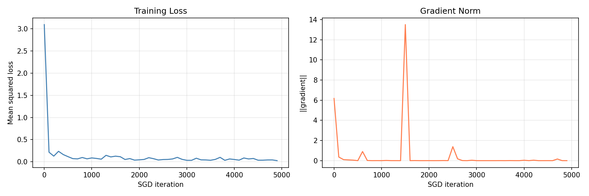

# 🐧 Penguin Species Classifier — Neural Network from Scratch

A feedforward neural network built with NumPy to classify penguin species (Adelie, Gentoo, Chinstrap) using the Palmer Penguins dataset.

## Overview

This project implements a two-layer neural network trained with stochastic gradient descent (SGD) and numerical gradient approximation via `scipy.optimize.approx_fprime`. No deep learning frameworks — just NumPy.

## Project Structure

```
.
├── penguin_nn.py      # Main script: data loading, training, evaluation, plotting
├── functions.py       # Neural network logic: forward pass, loss, SGD loop, predict
├── penguin-data.json  # Dataset (Palmer Penguins)
├── requirements.txt
└── training_curves.png
```

## Model Architecture

```
Input (4) → Hidden (20, tanh) → Output (3, tanh)
```

| Layer | Size | Activation |
|-------|------|------------|
| Input | 4 features | — |
| Hidden | 20 neurons | tanh |
| Output | 3 classes | tanh |

**Total parameters:** 67 (32 + 8 + 24 + 3)

## Features

- **4 input features:** bill length, bill depth, flipper length, body mass
- **3 output classes:** Adelie, Gentoo, Chinstrap
- **Label encoding:** one-hot style with ±1 targets, e.g. Adelie → `[1, -1, -1]`
- **Loss function:** mean squared error
- **Optimizer:** SGD with numerical gradient (step size `1e-6`)
- **Data split:** 90% train / 10% test, randomly shuffled

## Results

Trained for 5000 iterations with learning rate `0.05`:

| Class | Accuracy | Samples |
|-------|----------|---------|
| Adelie | 100.0% | 13 |
| Gentoo | 100.0% | 16 |
| Chinstrap | 100.0% | 6 |
| **Overall** | **100%** | **35** |

### Training Curves



## Usage

**Install dependencies:**
```bash
pip install -r requirements.txt
```

**Run:**
```bash
python penguin_nn.py
```